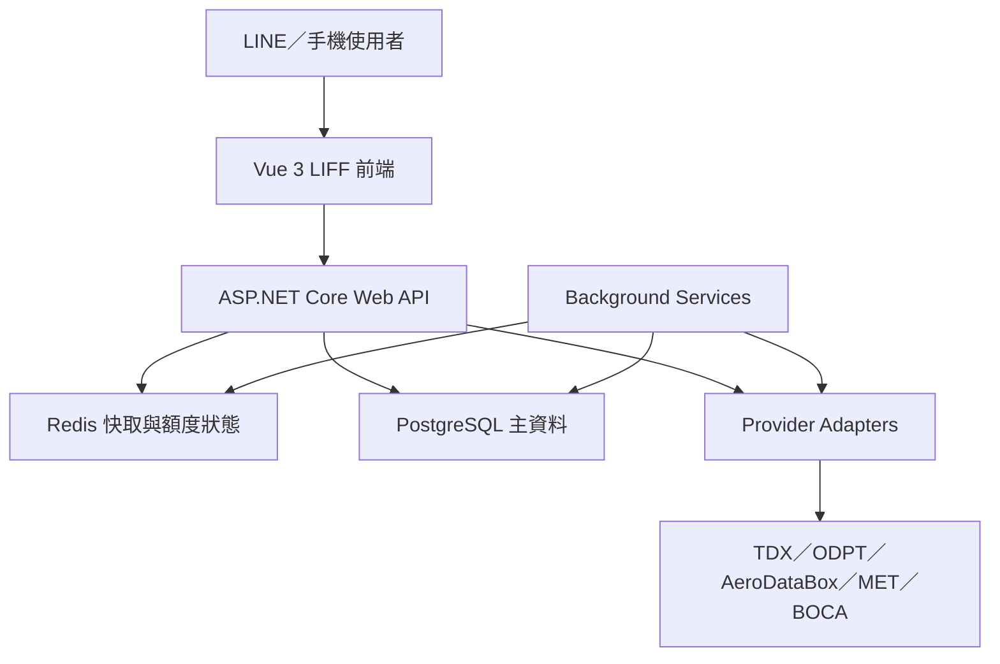
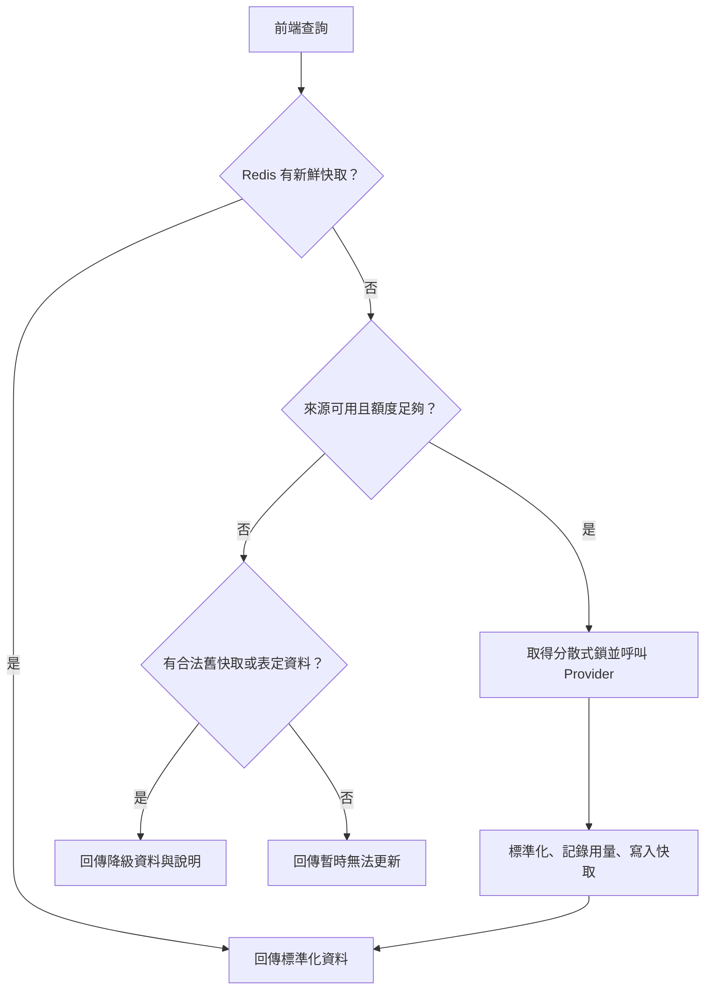

# 旅客交通資訊助手－MVP 需求規格與系統架構

- 文件版本：1.0
- 凍結日期：2026-09-21
- 外部方案查核日：2026-09-21（實際額度與授權仍以申請帳號當下的 Provider／Marketplace 後台為準）
- 專案性質：個人履歷作品、非商業 MVP
- 主要使用者：以 LINE 為主要入口的台灣自由行及旅行團旅客
- MVP 原則：零 API 費用、真實資料、中央快取、前後端完全分離、可平滑升級付費方案

> 實作進度（2026-09-21）：Phase 1、2 已完成；Phase 3 已完成台北公車與台北捷運第一版，台鐵仍待實作。實際 TDX endpoint、快取與額度設定請見 [TDX 整合說明](TDX_INTEGRATION.md)。

---

## 1. 專案定位

本系統提供旅客在台灣及海外旅行時所需的交通與安全資訊。MVP 不是訂票平台、旅行社 ERP 或即時地圖，而是可從 LINE 快速開啟的旅遊資訊附加服務，同時作為履歷與面試展示作品。

### 1.1 核心價值

1. 一個入口整合大眾運輸、全球航班、天氣、旅遊警示及應急資訊。
2. 依使用者目前城市，只顯示系統已整合的服務。
3. 第三方資料先由後端取得並快取，再提供給所有使用者，避免每位使用者直接消耗 API 額度。
4. 免費方案用完時安全降級，不自動產生費用。
5. 未來升級付費方案時，只調整額度與快取頻率，不更換前端 API 或重建資料模型。

### 1.2 MVP 不包含

- 車票、機票或行程預訂與付款。
- 座位、票價與庫存查詢。
- 車輛、列車或飛機即時位置地圖。
- 導航、路線規劃及轉乘最佳化。
- 多段轉機航班組合搜尋。
- 推播通知。
- 會員註冊、密碼及個人帳號中心。
- 旅行團名單、訂單、ERP 或 CRM 串接。
- 旅行社正式商業營運。

---

## 2. MVP 產品形式

### 2.1 第一階段形式

採用 **Vue 3 LIFF Web App**，由 LINE 圖文選單、官方帳號訊息或專屬連結開啟，在 LINE 內完成操作，不要求使用者另外下載 App。

LINE MINI App 正式上架需要額外資格與審查，因此第一階段不以「已上架 LINE MINI App」為完成條件。LIFF 前端的介面與程式架構需保持與未來 LINE MINI App 相容，取得資格後不重做核心功能。

### 2.2 使用者識別

- MVP 不建立會員系統。
- 不要求使用者登入本系統。
- 不儲存 LINE 個人檔案、好友關係或聊天內容。
- 上次城市、最近查詢及收藏存放於瀏覽器 `localStorage`。
- 後端只接收完成查詢所需的城市、路線、站點、機場及日期參數。

---

## 3. 導覽與頁面結構

桌面版使用可收合的左側導覽列；手機及 LINE 內建瀏覽器使用抽屜式側欄。

1. 首頁
2. 大眾運輸
3. 航班查詢
4. 天氣
5. 旅遊警示
6. 應急資訊

### 3.1 城市選擇規則

- 系統不設置獨立的國家選擇頁。
- 大眾運輸、天氣、旅遊警示及應急資訊以「城市」為主要情境。
- 第一次使用且無定位結果時，預設城市為台北。
- 後續預設城市為使用者上次選擇的城市。
- 城市為全站共用，不按功能分別保存。
- 航班查詢不受目前城市限制，可搜尋全球任意兩個機場。

### 3.2 定位規則

1. 第一次進入系統時請求瀏覽器定位權限。
2. 若拒絕，下一次進入時系統仍會再次嘗試；若瀏覽器已封鎖原生提示，顯示開啟定位權限的說明。
3. 定位成功後，只將座標映射為支援城市，不長期保存精確座標。
4. 若定位城市與目前城市不同，例如目前選擇台北但定位在東京，提示「偵測到你目前在東京，是否切換？」。
5. 使用者拒絕切換時，維持原城市。
6. 定位失敗時依序使用上次城市、台北。

---

## 4. 城市與服務能力

### 4.1 第一版交通城市

| 城市 | 大眾運輸範圍 | 主要資料來源 |
|---|---|---|
| 台北 | 台北市公車、台北捷運、台鐵 | TDX |
| 東京 | Tokyo Metro、都營地鐵、都營巴士等已取得穩定資料的服務 | ODPT |

JR East 等尚未取得適合長期使用之正式資料源的服務，不在 MVP 顯示入口，也不能讓使用者誤以為東京沒有該交通服務。

### 4.2 服務狀態模型

| 狀態 | 使用者介面 | 說明 |
|---|---|---|
| 已整合且正常 | 顯示入口與資料 | 正常服務 |
| 當地有，但系統尚未整合 | 不顯示入口 | 不代表當地沒有該交通工具 |
| 明確不開放 | 必要時標示「尚未支援」 | 用於已進入相關流程但無法使用的情境 |
| 已整合但資料暫時中斷 | 保留入口並說明 | 使用快取或表定資料降級 |

後端以 `city_service_capabilities` 維護城市、服務類型、整合狀態與可用狀態，前端不得自行硬編碼各城市功能。

---

## 5. 功能需求

### 5.1 首頁

首頁提供：

- 目前城市與切換城市入口。
- 定位城市切換提示。
- 大眾運輸、航班、天氣、旅遊警示、應急資訊快捷卡片。
- 目前城市的天氣摘要。
- 最高等級旅遊警示摘要。
- 資料來源暫時異常提示。
- 最近查詢與收藏入口，資料只存在本機。

### 5.2 大眾運輸

#### 查詢內容

- 依目前城市顯示已整合的公車、捷運／地鐵及火車。
- 查詢路線、方向、車站／站牌及表定班次。
- 查詢還有多久到站。
- 不提供即時位置地圖。

#### 到站顯示規則

| 條件 | 顯示方式 |
|---|---|
| 距離到站超過 60 分鐘 | 顯示表定時間 |
| 距離到站 60 分鐘內且即時資料有效 | 顯示即時預估分鐘數 |
| 少於 1 分鐘 | 顯示「即將進站」 |
| 即時資料超過 2 分鐘未更新 | 改顯示表定時間並標示資料暫時未更新 |
| 即時資料缺失 | 顯示表定時間，不顯示錯誤分鐘數 |

前端可以根據後端提供的預估到站時間在本機每分鐘倒數，但不得為了倒數每分鐘呼叫後端。

### 5.3 全球航班查詢

#### 查詢方式

1. 出發機場＋抵達機場＋日期。
2. 航班編號＋日期。

#### 第一版範圍

- 支援全球任意兩個機場之間的直飛航班。
- 不限制台灣出發或抵達。
- 不提供票價、訂位及轉機組合。
- 航班卡片顯示航空公司、航班編號、出發／抵達機場、表定／預估／實際時間、狀態、航廈、登機門及資料更新時間。
- 航廈或登機門欄位缺失時顯示「尚未提供」，不能視為整個資料來源中斷。
- 時間採機場當地時間、24 小時制，跨日需標示 `+1 日` 等資訊。

#### 未來轉機擴充

內部模型從第一版即採用：

```text
Itinerary
└── FlightSegment[]
```

第一版固定 `maxStops = 0`，因此未來加入一段或多段轉機時，不需重建前端主要資料結構。

#### 航班資料取得

- 正式 Provider：AeroDataBox RapidAPI Basic。
- 不使用假資料冒充即時航班。
- 一個完整日期拆成兩個 12 小時 FIDS 查詢。
- 外部快取鍵使用「出發機場＋日期＋12 小時區段」，後端再依目的地篩選，因此相同出發機場及日期可服務多個目的地查詢。
- 機場自動完成使用本地 OurAirports 資料，不消耗航班 API 額度。

### 5.4 天氣

- 顯示目前城市或定位地點的天氣。
- 顯示目前氣溫、體感溫度、天氣狀況、降雨、濕度、風速及未來預報摘要。
- 資料來源為 MET Norway Locationforecast。
- 使用城市座標或最多四位小數的定位座標查詢。
- 遵守 API 回應中的 `Expires`、`Last-Modified` 與快取規則。
- 定位成功時可在全球取得目前位置天氣；城市切換以系統城市資料表的座標為準。

### 5.5 旅遊警示

- 顯示外交部領事事務局發布的官方旅遊警示。
- 首頁顯示目前城市所屬國家／地區的最高警示。
- 警示頁顯示目前位置、目前選擇城市及國人熱門目的地。
- 顯示警示等級、地區範圍、發布／更新時間、內容摘要及官方來源連結。
- 旅遊相關新聞只納入官方或可明確追溯來源、且會影響旅遊安全或交通的內容。
- 不將一般娛樂或廣告新聞混入警示。

### 5.6 應急資訊

- 優先使用目前定位城市；其次為目前選擇城市；最後使用預設城市。
- 顯示當地警察、救護車、消防、旅遊警察等電話。
- 顯示台灣駐外館處名稱、地址、聯絡電話及官方來源。
- 提供護照遺失、財物失竊、就醫及重大事故處理說明。
- 緊急電話只以文字顯示，不設計一鍵撥打按鈕。
- 每筆資料顯示來源與最後人工確認日期。
- 主要資料存於 PostgreSQL，不在使用者開啟頁面時臨時呼叫外部 API。

---

## 6. 非功能需求

### 6.1 資料正確性

- 所有卡片必須顯示資料更新時間或資料時間。
- 即時、快取、表定及無法使用必須明確區分。
- 不得以本機倒數偽裝成仍在更新的即時資料。
- 外部資料先轉為統一內部模型，前端不直接解析各 Provider 格式。

### 6.2 效能

- 快取命中時，後端目標回應時間小於 500 ms。
- 所有第三方呼叫都由後端執行。
- 相同快取鍵同時過期時，只允許一個請求向外部 API 更新，其他請求等待或取得舊快取，避免快取擊穿。

### 6.3 隱私

- 精確定位座標只用於當次城市判斷或天氣查詢。
- 不在 PostgreSQL 保存個人定位軌跡。
- 不建立跨裝置個人行為追蹤。
- API 金鑰只存在後端環境變數或祕密管理，不進入前端及 GitHub。

### 6.4 可用性

- 第三方 API 中斷不能造成整站錯誤。
- 每個 Provider 有獨立 timeout、circuit breaker、用量計數與狀態。
- 介面以繁體中文為主。
- 城市、車站、機場保留當地名稱與英文名稱。
- 機場顯示中文名稱、英文名稱及 IATA 代碼。

---

## 7. 免費額度與降級策略

### 7.1 TDX

官方基礎會員：每月 3 點、每把金鑰每分鐘 5 次。基礎服務的概算公式：

```text
使用點數 ≈ 請求次數 / 1500 + 傳輸 MB / 150
```

MVP 規則：

- 正常預算：2.7 點。
- 例外預留：0.3 點。
- 一般查詢達 2.7 點即停止發出新的外部請求；最後 0.3 點只供已在途請求、必要的一次有限重試及人工校準使用。
- 不將官方額外 5% 緩衝列入正常可用額度。
- 內部速率限制：每分鐘最多 4 次。
- 實際串接後，依端點記錄請求次數與回應 bytes，校準可用次數。
- 到站資料採按需查詢與 2 分鐘共用快取，不輪詢整個台北市。
- 額度用完時接受 TDX 自動停止，系統改用表定資料。

### 7.2 AeroDataBox

RapidAPI Basic 免費方案：

- 400 API units／計費週期。
- 1,600 requests 硬上限。
- 航班狀態與 FIDS 為 Tier 2，每次 2 units。
- 一個完整日期 FIDS 需要兩次呼叫，共 4 units。
- 快取／資料保留不得超過方案允許的 7 天。
- 必須顯示 AeroDataBox 資料來源。
- 免費方案僅用於目前非商業履歷 MVP。

MVP 預算：

| 用途 | 規劃量 | Units |
|---|---:|---:|
| 出發機場＋日期完整航班表 | 70 組 | 280 |
| 單一航班狀態更新 | 40 次 | 80 |
| 例外預留 | — | 40 |
| 合計 | — | 400 |

未使用的類別額度可由另一類查詢使用，不強制切成兩個不可互通的額度池。

- `softStopUnits = 360`：停止新的未命中 FIDS 全日搜尋。
- `hardStopUnits = 400`：停止所有 AeroDataBox 外部請求；最後 40 units 只供已在途請求、必要的一次有限重試及航班編號狀態查詢。
- 每次外部請求前先以端點 Tier 預扣 units，完成後再依 Provider 回應校正，避免併發請求同時穿越上限。
- 啟用金鑰前須再次核對 RapidAPI 訂閱頁的方案、週期、硬上限與 overage 設定；若免費方案條件改變，系統停用外部呼叫，不自動改訂付費方案。

RapidAPI 另有 10,240 MB／月平台流量額度。系統以 9,000 MB 為內部停止線，避免任何平台流量費。

### 7.3 其他來源

| 資料源 | 更新與限制策略 |
|---|---|
| MET Norway | 按 `Expires` 更新；兩個常用城市每小時一次約 1,440 次／30 天；帶可聯絡的 `User-Agent`、標示來源，不得超過 20 requests／秒 |
| BOCA RSS | 每小時條件式取得一次，約 720 次／30 天 |
| ODPT | 無公開固定月額度；依 `odpt:frequency` 及 `dct:valid`；沒有使用者時不做即時輪詢 |
| OurAirports | 每月更新一次機場主檔 |
| 緊急資訊 | 每月人工抽查，來源重大變更時更新 |

### 7.4 額度耗盡後

1. Provider 回傳 quota／rate-limit 錯誤後，標記該來源在本計費週期暫停。
2. 不讓每位使用者繼續重試同一外部 API。
3. 保留功能入口。
4. 優先回傳仍合法且可用的快取。
5. 交通改為表定資料；航班無合法快取時顯示暫時無法更新。
6. 下一計費週期清除額度耗盡狀態並恢復查詢。
7. 不啟用自動升級、超額付費或自動購買額度。

額度與方案是會變動的外部條件，不可寫死為永久事實。系統設定需保存 `verifiedAt`、`billingCycleStart`、`softLimit`、`hardLimit` 與 `overageEnabled=false`；每次部署前重新核對 Provider 後台。

---

## 8. 完整技術架構

### 8.1 技術棧

| 層級 | 技術 |
|---|---|
| LINE 入口 | LIFF SDK、LINE 圖文選單／連結 |
| 前端 | Vue 3、TypeScript、Vite、Vue Router、Pinia |
| 後端 | ASP.NET Core Web API、C#、Dependency Injection |
| 資料庫 | PostgreSQL、EF Core |
| 即時快取 | Redis |
| 背景工作 | .NET Background Service |
| 部署 | Docker、HTTPS、反向代理 |
| 文件 | OpenAPI／Swagger、README、架構與 API 文件 |

### 8.2 系統拓樸



### 8.3 請求流程



### 8.4 後端分層

```text
Controllers
  └── 接收 HTTP、驗證參數、回傳統一 JSON

Application Services
  └── TransitService / FlightService / WeatherService / AlertService / EmergencyService

Domain Models
  └── City / Arrival / Itinerary / FlightSegment / Weather / Alert / EmergencyInfo

Provider Interfaces
  └── ITransitProvider / IFlightProvider / IWeatherProvider / IAlertProvider

Provider Implementations
  └── TdxProvider / OdptProvider / AeroDataBoxProvider / MetNorwayProvider / BocaProvider

Infrastructure
  └── PostgreSQL / Redis / HTTP Clients / Quota Tracking / Background Jobs
```

所有第三方 Provider 必須透過介面注入 Application Service，不得在 Controller 直接呼叫外部 API。

---

## 9. 資料儲存設計

### 9.1 PostgreSQL

| 資料表 | 用途 |
|---|---|
| `cities` | 城市、國家／地區、時區、中心座標、定位範圍 |
| `city_aliases` | 城市中文、英文及當地語言別名 |
| `city_service_capabilities` | 城市對應功能、整合狀態、可用狀態 |
| `data_sources` | Provider、授權、來源連結、資料類型 |
| `data_source_status` | 正常、暫時中斷、額度耗盡及最近成功時間 |
| `transit_modes` | 公車、捷運／地鐵、火車等模式 |
| `transport_operators` | 營運業者 |
| `routes` | 路線主檔 |
| `stops` | 車站／站牌主檔 |
| `route_stops` | 路線、方向與停靠順序 |
| `service_calendars` | 平日、假日與特殊營運日 |
| `trips` | 表定班次 |
| `stop_times` | 各班次表定到離站時間 |
| `airports` | IATA／ICAO、名稱、城市、時區、座標 |
| `airport_aliases` | 機場中文與搜尋別名 |
| `travel_alerts` | 官方旅遊警示與來源資訊 |
| `emergency_contacts` | 城市／國家緊急聯絡資料 |
| `emergency_guides` | 護照遺失、失竊、就醫等指引 |
| `api_usage_cycles` | 各 Provider 計費週期與彙總用量 |
| `api_usage_events` | 每次外部呼叫之端點、狀態、bytes、units／估算點數 |
| `refresh_jobs` | 背景更新狀態與最近成功時間 |

MVP 不需要 MongoDB。結構化、可關聯及需要一致性的主資料使用 PostgreSQL；短期即時資料使用 Redis。

### 9.2 Redis

建議快取鍵：

```text
transit:arrival:{provider}:{routeUid}:{direction}:{stopUid}
flight:fids:{originIata}:{date}:{timeBlock}
flight:status:{flightNumber}:{date}
weather:{roundedLat}:{roundedLon}
alert:{regionCode}
quota:{provider}:{billingCycle}
source-status:{provider}
lock:{cacheKey}
```

### 9.3 localStorage

```text
lastSelectedCityId
recentTransitQueries
recentFlightQueries
favoriteStops
favoriteRoutes
locationPromptState
```

不得將第三方 API 金鑰、精確定位歷史或敏感資料放入 localStorage。

---

## 10. 後端 API 契約

所有路徑以 `/api/v1` 開頭，回傳 JSON。

下表為跨 Provider 的目標契約；目前台北交通 MVP 採用 `/transit/bus/*` 與 `/transit/metro/*` 的明確資源路徑，詳見 TDX 整合說明與 Swagger。

| Method | Endpoint | 用途 |
|---|---|---|
| GET | `/cities` | 可選城市與服務摘要 |
| GET | `/cities/{cityId}/services` | 該城市已整合服務及狀態 |
| POST | `/location/resolve-city` | 將座標映射為支援城市 |
| GET | `/transit/modes?cityId=` | 城市可用交通模式 |
| GET | `/transit/routes?cityId=&mode=&q=` | 路線搜尋 |
| GET | `/transit/routes/{routeId}/stops?direction=` | 路線與站序 |
| GET | `/transit/stops/{stopId}/arrivals` | 即時／表定到站資料 |
| GET | `/airports?q=` | 本地機場自動完成 |
| GET | `/flights/search?origin=&destination=&date=` | 全球直飛航班搜尋 |
| GET | `/flights/{flightNumber}?date=` | 航班編號狀態 |
| GET | `/weather?cityId=` | 城市天氣 |
| GET | `/weather/location?lat=&lon=` | 定位地點天氣 |
| GET | `/alerts?cityId=` | 城市／國家旅遊警示 |
| GET | `/alerts/popular` | 熱門目的地警示 |
| GET | `/emergency?cityId=` | 城市應急資訊 |
| GET | `/system/sources` | 前端需要的資料來源狀態摘要 |

### 10.1 統一回應 metadata

```json
{
  "data": {},
  "meta": {
    "dataStatus": "realtime | scheduled | cached | unavailable",
    "source": "TDX",
    "sourceUpdatedAt": "2026-09-21T10:00:00+08:00",
    "fetchedAt": "2026-09-21T10:00:10+08:00",
    "stale": false,
    "message": null
  }
}
```

前端只依統一狀態呈現，不判斷各 Provider 的原始錯誤碼。

---

## 11. 前端路由與狀態

| Route | 頁面 |
|---|---|
| `/` | 首頁 |
| `/transit` | 大眾運輸模式與最近查詢 |
| `/transit/routes/:routeId` | 路線方向、站點與到站資訊 |
| `/flights` | 全球航班搜尋 |
| `/flights/:flightNumber` | 航班詳細卡片 |
| `/weather` | 天氣 |
| `/alerts` | 旅遊警示與官方消息 |
| `/emergency` | 應急電話與處理指引 |

Pinia 建議 stores：

- `appStore`：LIFF 初始化、全域來源狀態。
- `cityStore`：目前城市、定位提示、城市能力。
- `transitStore`：路線與到站結果。
- `flightStore`：機場、查詢條件與航班結果。
- `preferenceStore`：localStorage 最近查詢與收藏。

---

## 12. 背景工作

| 工作 | 建議頻率 |
|---|---|
| TDX／ODPT 靜態路線與站點同步 | 每週一次；服務改版時手動觸發 |
| 表定時刻同步 | 每日或依來源更新週期；受 TDX 當月點數控制 |
| BOCA 旅遊警示 | 每小時一次 |
| MET Norway 常用城市天氣 | 依 `Expires`，通常約每小時 |
| OurAirports 機場資料 | 每月一次 |
| 緊急資訊檢查提醒 | 每月一次，實際內容人工確認 |
| API 用量週期重置 | 依各 Provider 計費週期 |

即時到站與即時航班不做全量背景輪詢，以使用者查詢及共用快取為主。

---

## 13. 錯誤與例外處理

| 狀況 | 後端處理 | 前端顯示 |
|---|---|---|
| Provider timeout | 最多一次有限重試；開啟 circuit breaker | 使用快取／表定資料 |
| 免費額度耗盡 | 記錄至計費週期結束，不再重試 | 保留入口並說明暫時無法更新 |
| 部分欄位缺失 | 保留整筆資料 | 欄位顯示「尚未提供」 |
| 快取過期但 Provider 中斷 | 依授權與安全性決定是否使用舊快取 | 顯示最後更新時間與過期警示 |
| 城市未整合服務 | 不呼叫 Provider | 不顯示入口 |
| 定位拒絕或失敗 | 使用上次城市／台北 | 非阻斷式提示 |
| 無符合航班 | 正常回傳空陣列 | 顯示「查無符合的直飛航班」 |

---

## 14. 驗收條件

### 14.1 共通

- 使用者可由 LINE 內開啟並完成所有操作。
- 重整頁面後仍保留上次選擇城市。
- 定位與目前城市不同時出現切換提示。
- 前端程式碼中不存在第三方 API 金鑰。
- Swagger 可檢視所有公開後端端點。

### 14.2 台北交通

- 可選擇公車、捷運及台鐵。
- 可查詢路線／車站與表定班次。
- 60 分鐘內有新鮮即時資料時顯示預估分鐘。
- 少於一分鐘顯示「即將進站」。
- 即時資料過期時自動回到表定時間。

### 14.3 東京交通

- 只顯示已整合之營運業者與交通模式。
- 不將未整合的 JR East 顯示成「東京沒有火車」。
- 資料顯示來源時間並遵守有效期限。

### 14.4 航班

- 可搜尋全球任意出發與抵達機場。
- 第一版只回傳直飛航班。
- 可依航班編號查詢。
- 航班卡片可處理航廈、登機門缺失。
- 同一出發機場及日期的不同目的地能共用 FIDS 快取。
- 免費額度用完後不產生費用、不造成整站錯誤。

### 14.5 安全資訊

- 旅遊警示可顯示目前位置、選擇城市及熱門目的地。
- 應急電話為純文字。
- 駐外館處與處理指引顯示來源及最後確認日期。

---

## 15. 建置順序

### Phase 1：專案骨架

- 建立 monorepo。
- Vue 3＋TypeScript＋LIFF 前端。
- ASP.NET Core Web API。
- PostgreSQL、Redis、Docker Compose。
- 統一回應格式、Provider 介面、錯誤處理。

### Phase 2：城市與首頁

- 城市主檔與能力矩陣。
- localStorage 上次城市。
- 定位與城市切換提示。
- 首頁及側欄。

### Phase 3：台北大眾運輸

- TDX 認證、靜態同步與資料校準。
- 公車、捷運、台鐵查詢。
- 即時到站、表定降級與 Redis 共用快取。
- TDX 點數與傳輸量監控。

### Phase 4：全球航班

- OurAirports 機場主檔。
- AeroDataBox Provider。
- 全球直飛搜尋、航班編號查詢及卡片。
- 400 units 與 10,240 MB 限額防護。

### Phase 5：旅遊輔助資訊

- MET Norway 天氣。
- BOCA 旅遊警示。
- 應急資訊與館處資料。

### Phase 6：東京交通

- ODPT 認證與資料模型轉換。
- Tokyo Metro、都營地鐵及都營巴士等穩定資料源。
- 有效期限與來源時間顯示。

### Phase 7：品質與履歷展示

- 自動化測試、API 合約測試及 Provider 模擬測試。
- Docker 部署、HTTPS 與環境變數。
- GitHub README、架構圖、操作 GIF／截圖及 Demo 資料說明。
- 清楚標示非商業 MVP 與資料來源授權。

---

## 16. 上線前必須實測的項目

以下不是產品需求未決，而是取得金鑰後的技術校準：

1. TDX 各實際端點套用 `$select`、`$filter` 後的平均回傳 bytes。
2. 第一次同步台北路線、站點與時刻資料所消耗的 TDX 點數。
3. TDX 後台統計與本系統估算點數的差異。
4. AeroDataBox FIDS 對大型機場單一 12 小時回傳是否需要額外分頁。
5. 航廈與登機門在台灣、日本及其他熱門機場的實際資料完整率。
6. ODPT 各 feed 的 `odpt:frequency`、`dct:valid` 與營運業者授權要求。
7. iOS／Android LINE 內建瀏覽器的定位拒絕、重新授權及 localStorage 行為。

實測結果只調整 Provider 設定、快取 TTL 與同步頻率，不改動產品核心需求。

---

## 17. 未來擴充但不納入 MVP

- 航班一段／多段轉機組合。
- 更多台灣城市與熱門海外城市交通。
- JR 等其他鐵路資料源。
- 旅程收藏跨裝置同步。
- 航班、警示與交通異常推播。
- 正式 LINE MINI App 審查上架。
- 旅行團行程、旅客名單及 ERP 串接。
- 商業方案與旅行社正式營運。

---

## 18. 官方資料來源

- TDX 收費與額度：https://tdx.transportdata.tw/pricing
- TDX 資料服務：https://tdx.transportdata.tw/data-service/basic
- ODPT 開發者網站：https://developer.odpt.org/
- ODPT 使用指引：https://developer.odpt.org/terms/data_basic_use_guideline.html
- AeroDataBox 定價：https://aerodatabox.com/pricing
- AeroDataBox RapidAPI 定價：https://rapidapi.com/aedbx-aedbx/api/aerodatabox/pricing
- MET Norway Locationforecast：https://api.met.no/weatherapi/locationforecast/2.0/documentation
- MET Norway 使用規範：https://api.met.no/doc/TermsOfService
- 外交部領事事務局旅遊警示：https://www.boca.gov.tw/sp-trwa-list-1.html
- OurAirports 開放資料：https://ourairports.com/data/

---

## 19. MVP 凍結結論

本文件所列功能、邊界、資料來源與系統架構作為第一版開發基準。後續 Codex 應先依 Phase 1 建立專案骨架，再逐階段完成，不應在未確認前加入訂票、地圖、會員、推播、轉機或 ERP 等範圍外功能。
