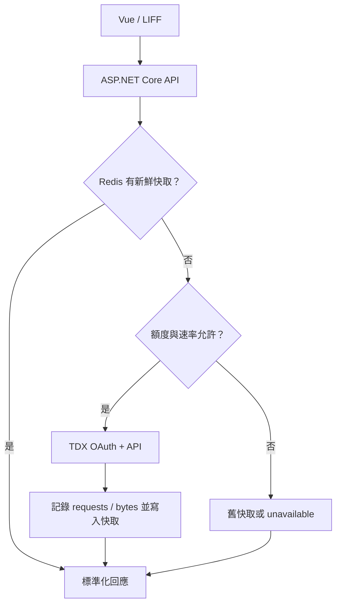

# TDX 台北交通整合

- 實作狀態：台北公車、台北捷運 MVP
- 方案查核日：2026-09-21
- 範圍外：訂票、票價、導航、即時車輛地圖、轉乘規劃、台鐵

## 查詢流程



前端不接觸 TDX 金鑰，也不因倒數顯示而輪詢 TDX。後端以快取鍵共用同一份資料；同一快取鍵同時失效時，只允許一個執行緒更新，其他請求等待更新結果。

## 使用的官方端點

| 功能 | TDX basic v2 endpoint | 新鮮快取 | 中斷保留 |
|---|---|---:|---:|
| 公車路線 | `Bus/Route/City/Taipei` | 1 日 | 7 日 |
| 路線站序 | `Bus/StopOfRoute/City/Taipei/{RouteName}` | 1 日 | 7 日 |
| 公車到站 | `Bus/EstimatedTimeOfArrival/City/Taipei/{RouteName}` | 2 分鐘 | 15 分鐘 |
| 捷運車站 | `Rail/Metro/Station/TRTC` | 7 日 | 30 日 |
| 捷運即時列車 | `Rail/Metro/LiveBoard/TRTC` | 2 分鐘 | 15 分鐘 |
| 捷運表定時刻 | `Rail/Metro/StationTimeTable/TRTC` | 1 日 | 7 日 |

每個請求都使用 `$select`，車站型端點再使用 `$filter`，避免下載未使用欄位。公車到站資料依「路線＋方向＋站牌」在自有 API 端篩選，但 Provider 快取以整條路線為單位，因此同一路線的旅客可共用一次 TDX 回應。

TDX 的公車 `EstimateTime` 單位為秒，捷運 LiveBoard 的 `EstimateTime` 單位為分鐘；Provider 會先轉成絕對時間，前端不直接解讀原始欄位。

## 免費額度保護

目前設定依 TDX 基礎會員方案：每月 3 點、每把金鑰每分鐘 5 次。系統採較保守的內部限制：

| 設定 | 值 | 用意 |
|---|---:|---|
| `RequestsPerMinute` | 4 | 留 1 次／分鐘緩衝 |
| `MonthlySoftLimitPoints` | 2.7 | 正常查詢停止線 |
| `MonthlyHardLimitPoints` | 3.0 | 官方免費額度參考值 |
| `AllowPaidOverage` | `false` | 系統不啟用付費超額流程 |
| Request 換算 | 1,500 次／點 | 依官方基礎服務方案 |
| 流量換算 | 150 MiB／點 | 程式以 bytes 精確累計 |

保守估算公式：

```text
estimatedPoints = requestCount / 1500
                + responseBytes / (150 × 1024 × 1024)
```

如果完全忽略傳輸量，2.7 點最多相當於 4,050 次請求；實際可用請求數一定較少，因此程式在每次外部請求前先預留 request 部分，回應後再加入真實 response bytes。達 2.7 點後不再發出新的 TDX 資料請求，0.3 點留給在途請求與流量誤差，不把官方額外緩衝當成正常額度。

`GET /api/v1/transit/tdx/status` 會回傳本計費月的 request 次數、bytes 與估算點數。MVP 預設單一 API instance；若日後水平擴充，額度預扣需改成 Redis transaction／Lua script，才能跨 instance 原子更新。

## 資料狀態與降級

所有交通回應都包含一致的 `meta`：

| `dataStatus` | 前端含義 |
|---|---|
| `realtime` | 本次取得的新鮮即時資料 |
| `scheduled` | 表定或靜態資料 |
| `cached` | 共用快取命中 |
| `unavailable` | 無可用資料；入口仍保留 |

快取更新失敗但仍有保留期內資料時，API 回傳 `stale: true` 與最後成功更新時間。沒有快取、金鑰未設定、速率限制或額度停止時，回傳空資料與可公開顯示的中文說明，不把 Provider 內部錯誤暴露給前端。

## 本機設定

1. 申請 TDX 基礎會員並建立 Client ID／Client Secret。
2. 複製 `.env.example` 為 `.env`。
3. 設定以下值：

```dotenv
TDX_CLIENT_ID=your-client-id
TDX_CLIENT_SECRET=your-client-secret
```

4. 執行 `docker compose up --build`。
5. 開啟 `/api/v1/transit/tdx/status`，確認 `configured` 為 `true`。

金鑰只由後端環境變數注入，不得寫入 `appsettings.json`、前端環境變數或 Git。

## 自有 API 範例

```http
GET /api/v1/transit/bus/routes?cityId={taipeiCityId}&q=307
GET /api/v1/transit/bus/stops?cityId={taipeiCityId}&routeName=307&direction=0
GET /api/v1/transit/bus/arrivals?cityId={taipeiCityId}&routeName=307&direction=0&stopId={stopUid}
GET /api/v1/transit/metro/stations?cityId={taipeiCityId}&q=台北
GET /api/v1/transit/metro/arrivals?cityId={taipeiCityId}&stationId=BL12
```

## 官方參考資料

- [TDX 收費與額度](https://tdx.transportdata.tw/pricing)
- [TDX 基礎服務](https://tdx.transportdata.tw/data-service/basic)
- [TDX 公車 API 說明](https://tdx.transportdata.tw/api-service/swagger/basic/BUS)
- [TDX 軌道 API 說明](https://tdx.transportdata.tw/api-service/swagger/basic/RAIL)

方案與欄位可能異動；每次正式部署前應重新核對官方頁面與帳號後台。
